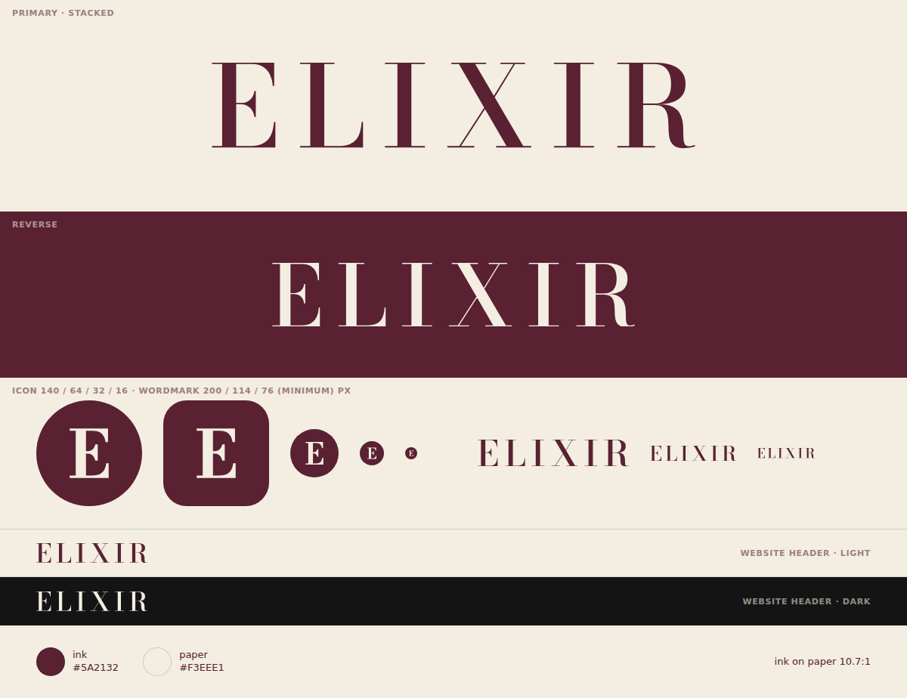

# Elixir — logo

The shop's own heading face, Bodoni Moda, set as wide perfume-house capitals in the Elixir maroon: the letter of
the classic perfume houses, for a shop that sells only original perfume. It keeps what the brand already owns
(the capitals ELIXIR, the maroon and cream of elixir.al) and replaces the thin, low-resolution `logo.png`, whose
second I merged into the R so it read as "ELIXR".



## Files

| File | Use |
| --- | --- |
| `logo/elixir-logo.svg` | Primary: maroon, on cream or any light ground |
| `logo/elixir-logo-reverse.svg` | Cream, on maroon or dark photos |
| `logo/elixir-logo-ink.svg` | One colour, maroon only (same as primary; for one-colour print in maroon) |
| `logo/elixir-logo-paper.svg` | One colour, cream only, on dark |
| `logo/elixir-logo-black.svg` | Pure black: thermal receipts, rubber stamps, laser engraving |
| `logo/elixir-logo-currentcolor.svg` | For inlining in the website: letters take the text colour (light and dark mode) |
| `logo/elixir-icon.svg` | Cream E on a maroon circle: favicon, small spaces |
| `logo/elixir-icon-square.svg` | Full square: app icon, social avatar, the site's `icon.svg` |
| `png/` | The same as PNG, plus `favicon.ico`, `favicon-32/48/96.png`, `apple-touch-icon.png`, `icon-192.png`, `icon-512.png`, `app-icon-1024.png`, `elixir-avatar-1080.png`, and `logo.png` (cream, 480 × 85, a drop-in for the site's current file) |

No stacked version: ELIXIR is one short word, and the E icon covers square spaces.

## Colours

The same values as elixir.al's CSS variables.

| Name | Hex | RGB | Role |
| --- | --- | --- | --- |
| Maroon (`--elixir-brand`) | `#5A2132` | 90 33 50 | The letters |
| Cream (`--elixir-bg`) | `#F3EEE1` | 243 238 225 | The ground |
| Black | `#000000` | 0 0 0 | One-colour print only |

Maroon on cream is 10.7:1 contrast. The site's text ink `#111111` is nearly as dark as the maroon (1.5:1), so the two
are never combined inside the logo. For print, have the printer match the maroon to a physical proof.

## Typeface

Bodoni Moda by Owen Earl, SIL Open Font License, the same family as the headings on elixir.al. Wordmark: optical
size 18, weight 560, letter-spacing 0.16 em. Icon: optical size 6, weight 700, so the E keeps its serifs at 16 px.
The logo files are outlines, so no font needs to be installed to use them.

## Rules

- **Clear space:** about 60 % of the logo's height on every side (the height of a lowercase x in the same type).
- **Minimum size:** wordmark 76 px / 19 mm wide, icon 16 px / 5 mm. Smaller than that, use the icon.
- **Don't** stretch, rotate, recolour it (no gold, no gradients), add shadows or effects, tighten the letter-spacing,
  place it on busy photos without enough contrast, or retype it in another font.

## Where each file goes

- **Website:** see below.
- **Instagram, Facebook, TikTok, WhatsApp, Google Maps profile:** `png/elixir-avatar-1080.png`; the platform crops it
  to a circle and the E stays whole.
- **Bags, boxes, cards, stickers, tissue paper:** `logo/elixir-logo.svg` in maroon, or `-reverse` in cream on a
  maroon ground.
- **Receipts and stamps:** `logo/elixir-logo-black.svg`.
- **Posts and stories:** `png/elixir-logo.png` or `-reverse.png` (transparent) over photos with enough contrast.

## On the website

Header and bottom bar: either inline the SVG so it follows light and dark mode by itself,

```html
<a class="wordmark" href="/" aria-label="Elixir — kryefaqja">
  <!-- paste logo/elixir-logo-currentcolor.svg here, with aria-hidden="true" on the <svg> -->
</a>
```

```css
.wordmark svg { display: block; height: 16px; width: auto; }
```

or replace `/logo.png` with `png/logo.png`. It is cream like the current file, so the existing
`filter: brightness(0)` still turns it black in light mode, but it is wider: change the logo component's
139 : 41 width ratio to 5.65 : 1 (16 px high = 90 px wide).

Icons: replace `/icon.svg` with `logo/elixir-icon-square.svg` (maroon to the edges and the E inside the safe circle,
so it still suits the manifest's `any maskable`), and add

```html
<link rel="icon" href="/favicon.ico" sizes="48x48">
<link rel="apple-touch-icon" href="/apple-touch-icon.png">
```

## Rebuilding

The logo is generated from `source/logo.json` with the logo-creation skill:

```bash
python .claude/skills/logo-creation/scripts/build_logo.py brand/elixir/source/logo.json
python .claude/skills/logo-creation/scripts/export_png.py brand/elixir/source/logo.json
python .claude/skills/logo-creation/scripts/proof.py brand/elixir/source/logo.json
```

`work/` keeps the two type comparison sheets and the site's current logo and icon for reference.
